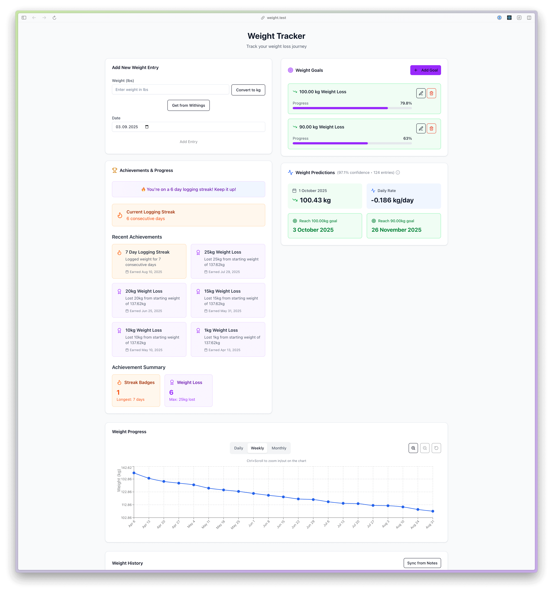

# Weight Tracker

A personal weight tracking application built with Laravel, Inertia.js, and React. This app helps you log and visualize your weight data while automatically syncing with macOS Notes.app for seamless tracking across devices.

## Features

- **Weight Entry & Tracking**: Log your weight with date and automatically calculate weight loss/gain
- **Unit Conversion**: Support for both kg and lbs with automatic conversion
- **Visual History**: View your weight history with monthly summaries and progress tracking
- **macOS Notes Integration**: Automatically updates a "weight" note in Notes.app with your latest entries
- **Withings Integration**: Sync weight data from Withings smart scales and health devices
- **Modern UI**: Clean, responsive interface built with Tailwind CSS and shadcn/ui components
- **Data Visualization**: Monthly weight summaries with loss calculations and trend analysis

## Screenshots




## Tech Stack

- **Backend**: Laravel 12
- **Frontend**: React with Inertia.js
- **Styling**: Tailwind CSS v4 + shadcn/ui
- **Database**: SQLite
- **Build Tool**: Vite
- **Platform Integration**: AppleScript (macOS Notes.app), Withings API
- **Custom Package**: Custom Withings SDK for PHP

## Installation

### Prerequisites

- PHP 8.2+
- Composer
- Node.js 18+
- npm
- macOS (for Notes.app integration)

### Quick Start

1. **Clone the repository**
   ```bash
   git clone <repository-url>
   cd weight-tracker
   ```

2. **Run the setup script**
   ```bash
   ./quick-start.sh
   ```

The script will automatically:
- Check prerequisites
- Install PHP and Node.js dependencies  
- Create and configure the `.env` file
- Set up the SQLite database
- Run migrations
- Build frontend assets
- Cache configuration

### Manual Setup

If you prefer to set up manually or the quick-start script fails:

1. **Install PHP dependencies**
   ```bash
   composer install
   ```

2. **Install Node.js dependencies**
   ```bash
   npm install
   ```

3. **Environment setup**
   ```bash
   cp .env.example .env
   php artisan key:generate
   ```

4. **Database setup**
   ```bash
   touch database/database.sqlite
   php artisan migrate
   ```

5. **Build frontend assets**
   ```bash
   npm run build
   ```

## Development

### Quick Start
```bash
# Start the full development environment (recommended)
composer run dev

# Or start services individually:
php artisan serve    # Laravel server
npm run dev         # Vite dev server
```

### Available Commands

**Development**
- `composer run dev` - Start full development environment (Laravel + Vite + queue worker)
- `php artisan serve` - Laravel development server only
- `npm run dev` - Vite development server for frontend assets
- `npm run build` - Build production frontend assets

**Database**
- `php artisan migrate` - Run database migrations
- `php artisan db:seed` - Seed database with test data

**Testing & Quality**
- `composer run test` - Run PHPUnit tests
- `./vendor/bin/pint` - Run Laravel Pint code formatter

**Weight Tracking Commands**
- `php artisan notes:update-weight` - Update Notes.app with current weight data
- `php artisan notes:get-weight` - Retrieve weight data from Notes.app
- `php artisan weight:generate-list` - Generate formatted weight list

## Usage

1. **Adding Weight Entries**: Use the web interface to log your weight with the current date
2. **Unit Conversion**: Enter weight in lbs or kg - the app handles conversion automatically  
3. **View History**: Browse your weight history with monthly summaries and loss calculations
4. **Notes Integration**: Your weight data automatically syncs to a "weight" note in Notes.app
5. **Withings Sync**: Connect your Withings account to automatically import weight measurements from your smart scale

## Architecture

### Backend Components
- **WeightEntry Model**: Stores weight records with validation (30-300 kg range)
- **WeightController**: Handles CRUD operations and Inertia view rendering
- **GenerateWeightListAction**: Formats weight entries with monthly summaries
- **NotesAppService**: AppleScript integration for Notes.app automation
- **Withings SDK**: Custom PHP SDK for Withings API integration (see packages/withings-sdk)

### Frontend Components  
- **WeightTracker.jsx**: Main React component with form and history display
- **shadcn/ui Components**: Modern, accessible UI components
- **Unit Conversion**: Built-in lbs ↔ kg conversion (factor: 0.453592)

### Database Schema
- `weight_entries` table: `id`, `date`, `weight_kg`, `created_at`, `updated_at`
- SQLite database stored at `database/database.sqlite`

## macOS Notes Integration

The app automatically maintains a "weight" note in Notes.app:
- Updates content between `== start` and `== end` markers
- Formats entries with HTML div tags for Notes.app compatibility
- Syncs whenever new weight entries are added
- Uses AppleScript for reliable Notes.app automation

## Withings Integration (Optional)

The app includes optional integration with Withings health devices via a custom PHP SDK:

### Features
- OAuth 2.0 authentication with Withings API
- Automatic weight measurement sync from Withings scales
- Support for multiple measurement types (weight, body composition, etc.)
- Rate limiting and error handling
- Comprehensive test coverage

### Setup Withings Integration

**Note:** Withings integration is completely optional. The app works fully without it - you can manually enter weight data through the web interface.

1. **Create a Withings Developer App**
   - Visit https://developer.withings.com/dashboard/
   - Create a new application
   - Set the redirect URL to: `{APP_URL}/oauth-callback/withings` (e.g., `http://localhost:8000/oauth-callback/withings`)

2. **Configure Environment Variables**
   - Add your Withings credentials to `.env`:
     ```env
     WITHINGS_CLIENT_ID=your_client_id_here
     WITHINGS_CLIENT_SECRET=your_client_secret_here
     WITHINGS_REDIRECT_URI=http://localhost:8000/oauth-callback/withings
     ```

3. **Initiate Login Flow**
   - Start the development server: `composer run dev`
   - Visit `{APP_URL}/w` (e.g., `http://localhost:8000/w`) to begin Withings authentication
   - Complete the OAuth flow to authorize the app with your Withings account

### Withings SDK Package
The Withings SDK (`packages/withings-sdk`) is developed as part of this project and will be published separately at:
**https://github.com/filipac/withings-sdk**

This allows other PHP projects to easily integrate with Withings devices and services. The SDK provides a clean, Laravel-friendly interface for:
- User authentication and token management
- Measurement data retrieval
- Device management
- Webhook handling for real-time updates

## Configuration

### Vite Configuration
- `@` alias points to `resources/js/` directory
- Local TLS detection for `weight.test` domain
- Hot module replacement for React components

### Tailwind CSS
- Version 4 (latest) with custom configuration
- shadcn/ui components configured in `components.json`
- Responsive design with mobile-first approach

## License

This project is open-sourced software licensed under the [MIT license](https://opensource.org/licenses/MIT).